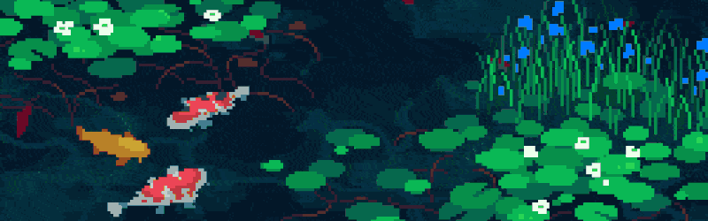

<div align="center" style="background: linear-gradient(90deg,#04202b,#08384a); padding: 20px; border-radius: 12px;">
  <!-- Use the existing project banner (if you want to swap to the PNG image you attached, I can upload it and switch the path) -->
  
  <h1 style="margin-top: 12px; color: #E6FFFA;">Hi, I'm Anderson González</h1>
  <p style="color: #BEE3DB; margin-top: -4px;">Full-Stack Developer • Systems Engineering Student</p>

  <div style="margin-top: 12px;">
    <a href="https://www.linkedin.com/in/anderson-gonzaleza21/" style="margin-right: 6px;"></a>
    <a href="https://anderdev-one.vercel.app/" style="margin-right: 6px;"></a>
    <a href="mailto:fabianagcris@gmail.com"></a>
  </div>
  
  <div style="margin-top: 18px;">
    
  </div>
  
  <div style="margin-top: 8px; color:#A7F3D0; font-size:14px;">
    <strong>Current focus:</strong> Full-Stack + AI Tooling • Passive game jams & experiments
  </div>
</div>

---

### What this repo is
A collection of personal projects and experiments focused on web and AI tools — curated, small, and useful.

---

### Quick Start

```bash
git clone git@github.com:Albonire/Albonire.git
cd Albonire
# Each project includes a README with setup and local run instructions
```

---

### Featured Projects

- 🧠 ia-humanizer — An orchestrator for humanizing AI-generated text (translation, rephrase, humanization, detection).
- ✅ To-DoList1.0 — Django-based task manager with auth, CRUD, filters and a weekly schedule view.

> Note: If you prefer detailed project cards, expand the "Full profile & stats" section below.

---

### Tech Overview


---

### Contribute

1. Fork the repo and create a branch: `git checkout -b feature/your-feature`
2. Commit changes and open a PR
3. Keep commits focused and descriptive

---

### Contact

- LinkedIn: https://www.linkedin.com/in/anderson-gonzaleza21/
- Email: fabianagcris@gmail.com

---

<details>
<summary>Full profile & stats (click to expand)</summary>

This section mirrors your original profile layout, keeping detailed visuals and the Recent Activity as-is.

<div style="margin-top: 8px;">
  
</div>

<div align="center" style="margin-top: 12px;">
  
</div>

### Featured Projects (with small cards)

<table width="100%" style="border-collapse: collapse;">
  <tr>
    <td style="padding: 10px; vertical-align:top;">
      <div style="border-radius:10px; padding: 12px; background:#0f1720; box-shadow: 0 6px 12px rgba(0,0,0,0.25);">
        <div style="font-size:30px; display:inline-block; background: #08292f; padding:8px; border-radius:8px; color:#fff;">🧠</div>
        <h4>ia-humanizer</h4>
        <p style="color:#9AE6B4;">Humanize AI text — pipelines for translation, paraphrase, detection and polishing.</p>
        <a href="https://github.com/Albonire/ia-humanizer">View project →</a>
      </div>
    </td>
    <td style="padding: 10px; vertical-align:top;">
      <div style="border-radius:10px; padding: 12px; background:#0f1720; box-shadow: 0 6px 12px rgba(0,0,0,0.25);">
        <div style="font-size:30px; display:inline-block; background: #0b3a2b; padding:8px; border-radius:8px; color:#fff;">✅</div>
        <h4>To-DoList1.0</h4>
        <p style="color:#9AE6B4;">Simple Django-powered task manager with auth and schedule view.</p>
        <a href="https://github.com/Albonire/To-DoList1.0">View project →</a>
      </div>
    </td>
  </tr>
</table>

<div style="margin-top: 16px;">
  <!--RECENT_ACTIVITY:start-->
⚔️ ⬆️ Pushed undefined commit(s) to [Albonire/Albonire](https://github.com/Albonire/Albonire)<br>
⚔️ ⬆️ Pushed undefined commit(s) to [Albonire/Albonire](https://github.com/Albonire/Albonire)<br>
⚔️ ⬆️ Pushed undefined commit(s) to [Albonire/ia-humanizer](https://github.com/Albonire/ia-humanizer)<br>
⚔️ ⬆️ Pushed undefined commit(s) to [Albonire/ia-humanizer](https://github.com/Albonire/ia-humanizer)<br>
⚔️ ⬆️ Pushed undefined commit(s) to [Albonire/ia-humanizer](https://github.com/Albonire/ia-humanizer)<br>
  <!--RECENT_ACTIVITY:end-->
  
  <!--RECENT_ACTIVITY:last_update-->
⏰ Last Chronicles Update: {{date}}
  <!--RECENT_ACTIVITY:last_update_end-->
</div>

<!-- second 'Full profile & stats' duplicate removed (already present above) -->
